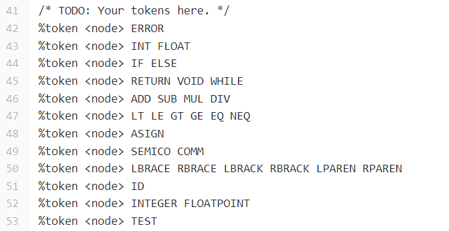

# Lab1_report

**PB19051157	陈兴焱**

## 实验要求

​	从无到有完成一个完整的 Cminus-f 解析器，包括基于 `flex` 的词法分析器和基于 `bison` 的语法分析器。

## 实验难点

- **实验文档的阅读**
  - 通过例子了解 `flex` 和 `bison` 的工作原理
  - 通过 `Cmakelist` 了解整个项目的结构
- **词法分析器**
  - 正则表达式中转义符'\\'的添加
  - 无用字符的过滤
  - 注释的正则表达式
- **语法分析器**
  - `code requires` 的添加
  - `node` 函数的理解
  - `empty` `epsilon` 相关

## 实验设计

- **修改.y文件**

  - 在 `.y` 文件声明所需 `token`

    

- **修改.l文件**

  - 在 `.l` 文件中补齐对应 `token` 的模式与行为

    

- **通过cmake构建，测试词法分析器**

  - 在 `build` 文件夹中 `make`

    

  - 对 `expr.cminus` 进行语法分析

    

- **修改.y文件**

  - 将 `.y` 文件中的文法补全

    

- **测试语法生成树**

  - 

- **调用脚本进行批量测试**

  - 

## 实验结果验证

- **TA 的测试样例**

  - 
  - 
  - 

- **自己的测试样例**

  - 测试代码

    ```c
    int a[5];
    int intf;
    a < b;
    a <= b;
    a > b;
    a >= b;
    a == b;
    /*/
    /*a*b*c/*/
    /*a*
    b*
    c/*/
    	a != b;
    ```

  - 词法测试

    

  - 语法树

    

## 实验反馈

- **小建议**
  - 希望助教在文档中能多给一些知识拓展链接，比如本次实验中Cmake相关的信息
