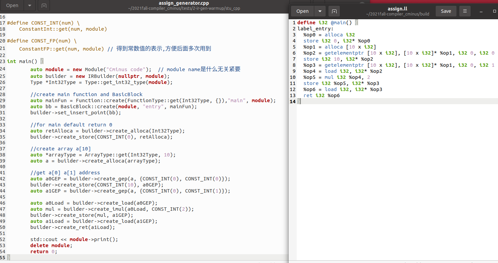
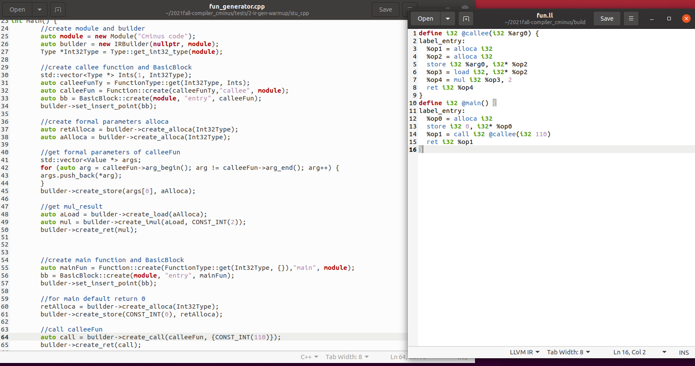
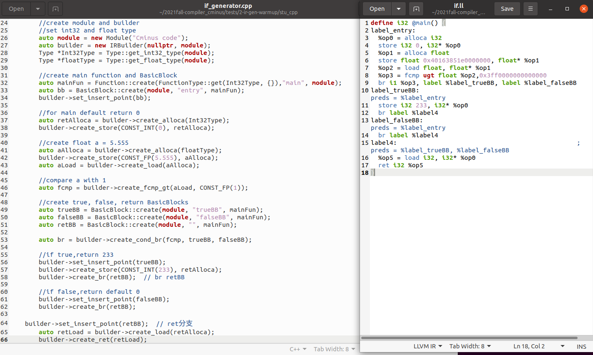
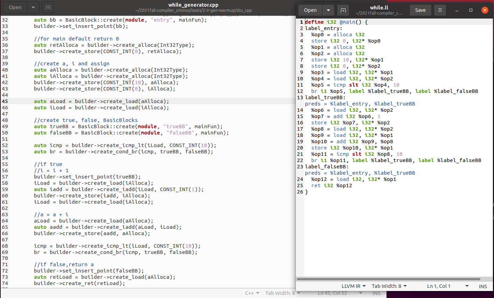
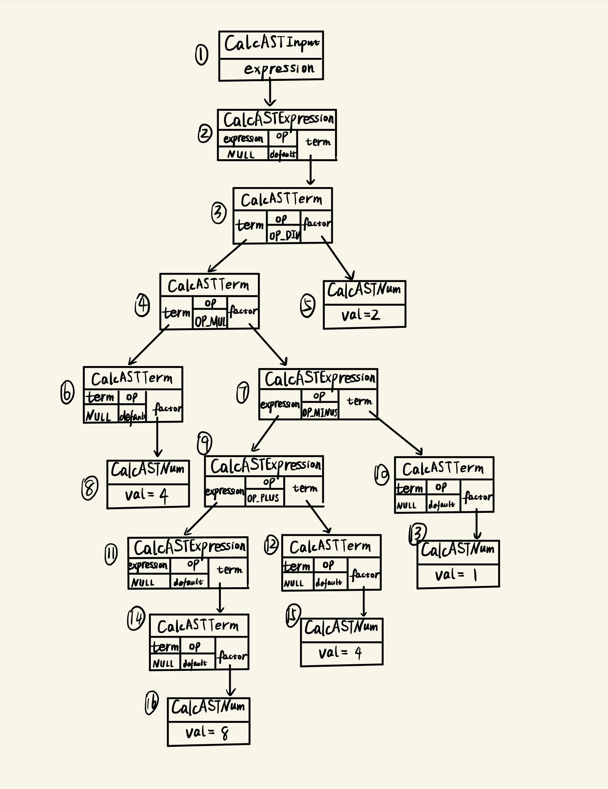
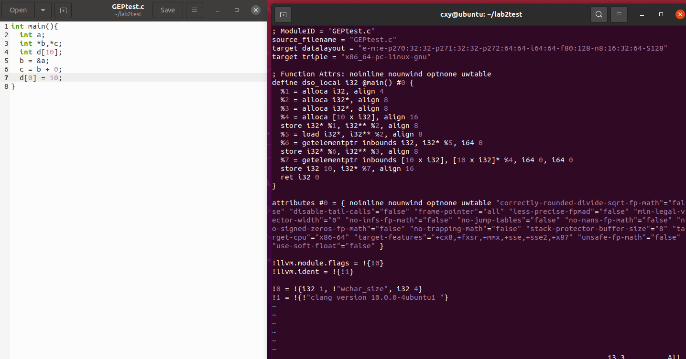

# lab2 实验报告

**学号:PB19051157**

**姓名:陈兴焱**

## 问题1: cpp 与 .ll 的对应

请说明你的 cpp 代码片段和 .ll 的每个 BasicBlock 的对应关系。

### assign

- **label_entry BasicBlock**（line number）
  - $.cpp:34-50$
  - $.ll:3-13$

### fun

- **callee label_entry BasicBlock**（line number）
  - $.cpp:37-50$
  - $.ll:3-8$
- **main label_entry BasicBlock**（line number）
  - $.cpp:60-65$
  - $.ll:12-15$

### if

- **label_entry BasicBlock**（line number）
  - $.cpp:37-53$
  - $.ll:3-9$
- **label_trueBB BasicBlock**（line number）
  - $.cpp:57-58$
  - $.ll:11-12$
- **label_falseBB BasicBlock**（line number）
  - $.cpp:62$
  - $.ll:14$
- **label4 BasicBlock**（line number）
  - $.cpp:65-66$
  - $.ll:16-17$

### while

- **label_entry BasicBlock**（line number）
  - $.cpp:36-53$
  - $.ll:3-12$

- **label_true BasicBlock**（line number）
  - $.cpp:58-69$
  - $.ll:14-22$
- **label_false BasicBlock**（line number）
  - $.cpp:73-74$
  - $.ll:24-25$

## 问题2: Visitor Pattern

分析 `calc` 程序在输入为 `4 * (8 + 4 - 1) / 2` 时的行为：

1. 请画出该表达式对应的抽象语法树（使用 `calc_ast.hpp` 中的 `CalcAST*` 类型和在该类型中存储的值来表示），并给节点使用数字编号。
2. 请指出示例代码在用访问者模式遍历该语法树时的遍历顺序。

序列请按如下格式指明（序号为问题 2.1 中的编号）：  
3->2->5->1

- **行为描述：**
  - 首先通过`parse()`对`input`建立语法树
  - 然后通过`AST`类的构造函数，构造抽象语法树，其中，实现方式是通过`transform_node_iter()`的递归调用
  - `builder`作为`visitor`,通过`visitor pattern`遍历抽象语法树，并且在其中插入`IR`代码，就形成了`.ll`文件内容
  - 最后将文件内容输出到`result.ll`文件，并通过命令行执行

- **question1：**

  

- **question2：**

  1->2->3->4->6->8->7->9->11->14->16->12->15->10->13->5

## 问题3: getelementptr

请给出 `IR.md` 中提到的两种 getelementptr 用法的区别,并稍加解释:

  - `%2 = getelementptr [10 x i32], [10 x i32]* %1, i32 0, i32 %0`
  - `%2 = getelementptr i32, i32* %1 i32 %0`

**GEP instruction:**

- **first argument(eg.[10 x i32])**
  - 表明计算基础类型
- **second argument(eg.[10 x i32]* %1)**
  - 计算基地址指针
- **third argument(eg. i32 0)**
  - first index
  - 由于不允许直接在指针上运算，所以这个索引是必须的，它相对第二个参数指针的地址偏移，偏移的单位大小是计算基础类型的大小
  - 其值为零时，也就是从基地址指针的地址处开始偏移
- **fourth argument(eg. i32 %0)**
  - second index
  - 在第一个偏移的基础上，再进行一次偏移，在第一个例子中，也就是数组的第一个元素

经过对以上特性的分析，易得

**difference：**

- 第一个例子，计算十个i32元素组成的数组中第一个元素的地址
- 第二个例子，计算相对i32指针%1偏移0个单位的地址

在分析的基础上，通过自己写程序，进行了验证

其中：

- 计算c值的ll代码与第二个例子类似
- 计算d[0]的地址的ll代码与第一个例子类似

## 实验难点

描述在实验中遇到的问题、分析和解决方案。

- 写$.ll$文件时，变量没有按顺序递增，报错
  - 错一个，影响一片，就很烦
  - 只能一个个改了，相当阴间
- 写$.cpp$文件时，在main的bbinsert之前，给变量分配了空间，报错$"segmentation\ fault"$
  - debug了半天，一句句语句注释，控制变量
  - 最后还是没有de出来，对照了室友的代码，最终发现了问题
  - 实在是没想到是顺序原因，也算是积累了经验
- visitor pattern给我看自闭了
  - 主要是不太会c++
  - 最后的解决方案就是，翻出程设Ⅱppt，重新学习虚函数、多态性等知识
  - 硬着头皮看了两天，终于看明白了

## 实验反馈

夸爆$simple\_cpp$，菜鸡狂喜，强烈建议多放扩展知识！

